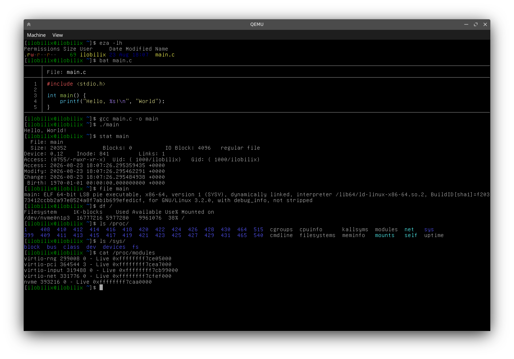
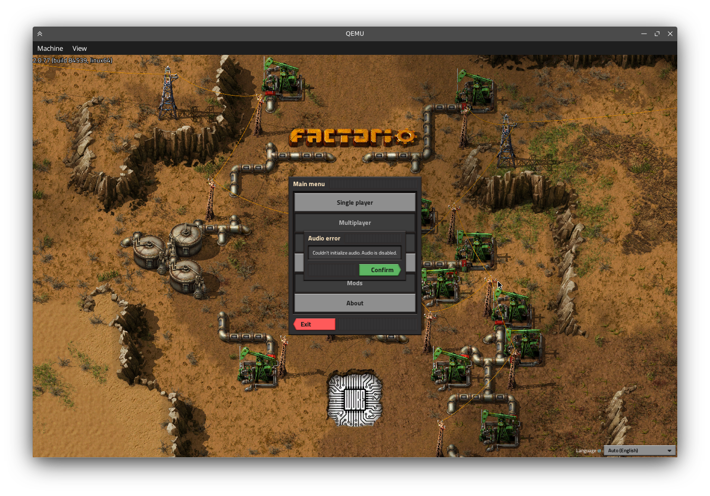
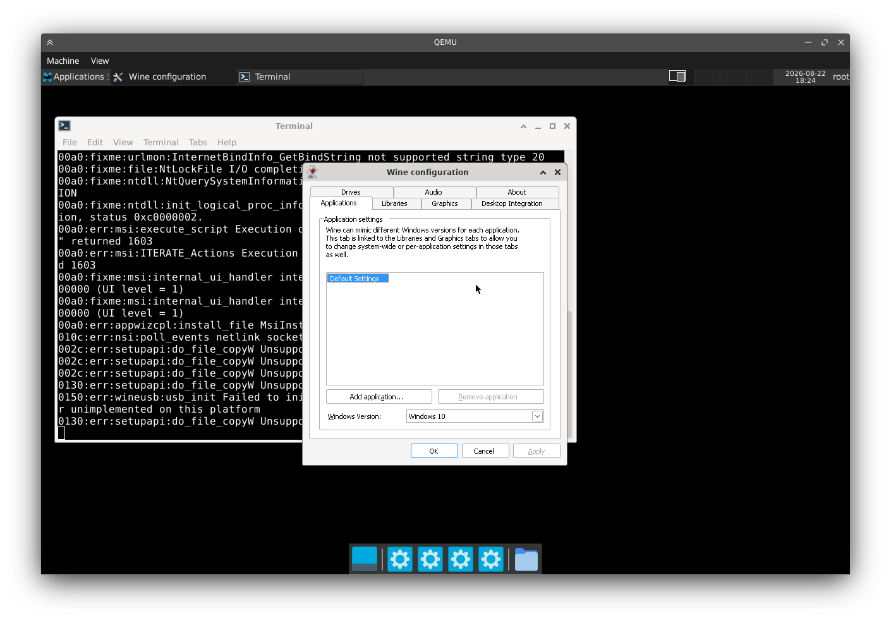

# Ilobilix

Monolithic hobby kernel written in modern C++26 with modules. Aims for Linux ABI compatibility in userspace.

Contributors are welcome! Feel free to open issues or submit pull requests.

> [!NOTE]
> This repo contains files needed to build and run the OS. Kernel source code is located in [ilobilix/kernel](https://github.com/ilobilix/kernel)

## License: [EUPL v1.2](LICENSE)

## Screenshots
<details>
<summary>Click here to expand</summary>






</details>

## Building And Running
* Make sure you are running an up-to-date Linux system and have following programs installed:
  * ``clang`` (21+)
  * ``clang-scan-deps`` (``clang-tools-extra``)
  * ``lld``
  * ``llvm``
  * ``make``
  * ``cmake``
  * ``ninja``
  * ``mtools``
  * ``sgdisk`` (for gpt disks)
  * ``parted`` (for mbr disks)
  * ``e2fsprogs`` (for disk image)
  * ``kmod`` (``depmod``)
  * ``fakeroot``
  * ``xorriso`` (for iso)
  * ``qemu-system``
  * ``qemu-user`` (for cross-arch builds. for example ``aarch64`` on ``x86_64`` host)
  * ``curl``
  * ``tar``
* Clone this repository:
  * ``git clone https://github.com/ilobilix/ilobilix --recursive``
* Build Ilobilix:
  * ``make``
* Run the OS in QEMU:
  * ``make run``
  * You can exit QEMU in the terminal with: ``ctrl+a x``

## Configurable Environment Variables
> [!NOTE]
> Default values are enclosed in ``<>``

### Shared Options
* ``ILOBILIX_ARCH=[<x86_64>|aarch64]``

### Build-Only Options
* ``ILOBILIX_BUILD_TYPE=[Release|<ReleaseDbg>|Debug]``
* ``ILOBILIX_LTO=[ON|<OFF>]`` (Requires 'Release' build type)
* ``ILOBILIX_LIMINE_MP=[<ON>|OFF]``
* ``ILOBILIX_UBSAN=[ON|<OFF>]``
* ``ILOBILIX_SCCACHE=[ON|<OFF>]``
* ``ILOBILIX_VOID_ROOTFS_DATE=<20250202>``
* ``ILOBILIX_VOID_INSTALL=<empty>`` (additional packages)
* ``ILOBILIX_VOID_REMOVE=<empty>``
* ``ILOBILIX_SYSROOT_DIR=<unset>``

### Run-Only Options
* ``QEMU_SMP=<6>``
* ``QEMU_MEM=<4G>``
* ``QEMU_NET=[<user>|tap|none]`` (``tap`` requires manually running ``support/tap.sh`` with sudo)
* ``QEMU_ACCEL=[<ON>|OFF]``
* ``QEMU_LOG=[ON|<OFF>]``
* ``QEMU_GDB=[ON|<OFF>]``

### Directory Structure
```text
ilobilix/
├── kernel/                # Ilobilix kernel repository
├──── kernel/kernel/       # ─ Kernel source code
├──── kernel/modules/      # ─ Loadable kernel modules
├── base-files/            # Customisations applied on top of the Void rootfs
├──── base-files/overlay/  # ─ Files copied onto the sysroot
├──── base-files/append/   # ─ Files that are appended to the ones in the sysroot
├── support/               # Various files for the build system
```

## Notable Projects Used
* [Limine](https://codeberg.org/Limine/Limine)
* [uACPI](https://github.com/uACPI/uACPI)
* [Fmtlib](https://github.com/fmtlib/fmt)
* [Void Linux](https://voidlinux.org/)

## AI usage disclosure
LLMs have been used for gathering information, researching needed topics, fixing bugs and minimal code generation (e.g. makefile build system in this repo).

## Known Bugs
* mp booting not working on ``aarch64``
* unconfirmed: sometimes sleeping thread doesn't wake up on bare metal
* unconfirmed: slab allocator memory mapping breaks on that one laptop
