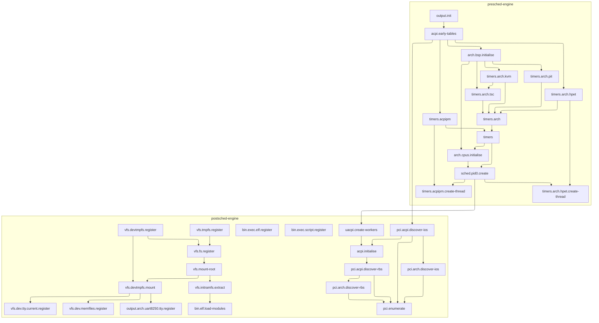

# Ilobilix
Monolithic Hobby OS in modern C++ 23 utilising modules where possible. It has support for custom loadable kernel modules. Its userspace aims to be ABI compatible with GNU/Linux.

Contributors are welcome! Feel free to open issues or submit pull requests.

## License: [EUPL v1.2](LICENSE)


## Building And Running
* Make sure you are running an up-to-date Linux system and have following programs installed:
  * ``clang`` (21+)
  * ``clang-scan-deps`` (``clang-tools-extra``)
  * ``lld``
  * ``llvm``
  * ``make``
  * ``cmake``
  * ``ninja``
  * ``xorriso``
  * ``qemu-system``
  * [Jinx dependencies](https://codeberg.org/mintsuki/jinx#dependencies)
* Clone this repository:
  * ``git clone https://github.com/ilobilix/ilobilix --recursive``
* Build Ilobilix:
  * This command will build the kernel, cross-compiler and userspace:
  * ``make all``
* Run the OS in QEMU:
  * ``make run-iso``

## Configurable Environment Variables
> [!NOTE]
> Default values are enclosed in ``<>``

### Shared Options
* ``ILOBILIX_ARCH=[<x86_64>|aarch64]``

### Build-Only Options
* ``ILOBILIX_PACKAGES=[<base>|coreutils|...]``
* ``ILOBILIX_BUILD_TYPE=[Release|<ReleaseDbg>|Debug]``
* ``ILOBILIX_LTO=[ON|<OFF>]`` (Requires 'Release' build type)
* ``ILOBILIX_SYSCALL_LOG=[ON|<OFF>]``
* ``ILOBILIX_LIMINE_MP=[<ON>|OFF]``
* ``ILOBILIX_UBSAN=[ON|<OFF>]``

### Run-Only Options
* ``QEMU_SMP=<6>``
* ``QEMU_ACCEL=[<ON>|OFF]``
* ``QEMU_LOG=[ON|<OFF>]``
* ``QEMU_GDB=[ON|<OFF>]``

### Directory Structure
```text
ilobilix/
├── kernel/           # Ilobilix kernel repository
├──── kernel/kernel/  # ─ Kernel source code
├──── kernel/modules/ # ─ Loadable kernel modules
├── base-files/       # Sysroot skeleton
├── host-recipes/     # Recipes for the toolchain used to build sysroot
├── patches/          # Patches for host and target recipes
├── recipes/          # Target sysroot recipes
├── source-recipes/   # Sources for host and target recipes
├── support/          # Various files for userspace and the build system
```

### Notable Pojects Used:
* [Limine](https://codeberg.org/Limine/Limine)
* [Jinx](https://codeberg.org/mintsuki/jinx)
* [uACPI](https://github.com/uACPI/uACPI)
* [Fmtlib](https://github.com/fmtlib/fmt)

## Known Bugs
* mp booting not working on ``aarch64``
* unconfirmed: sometimes sleeping thread doesn't wake up on bare metal
* unconfirmed: slab allocator memory mapping breaks on that one laptop

## Initgraph
